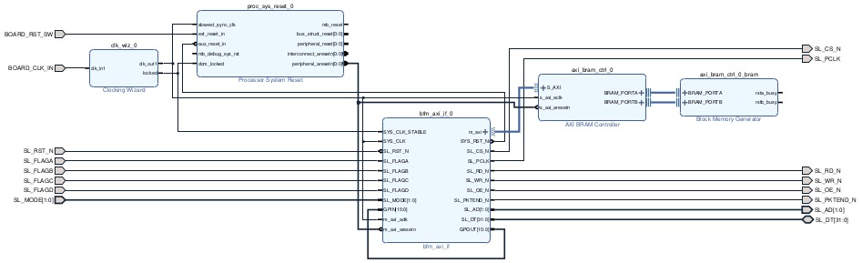
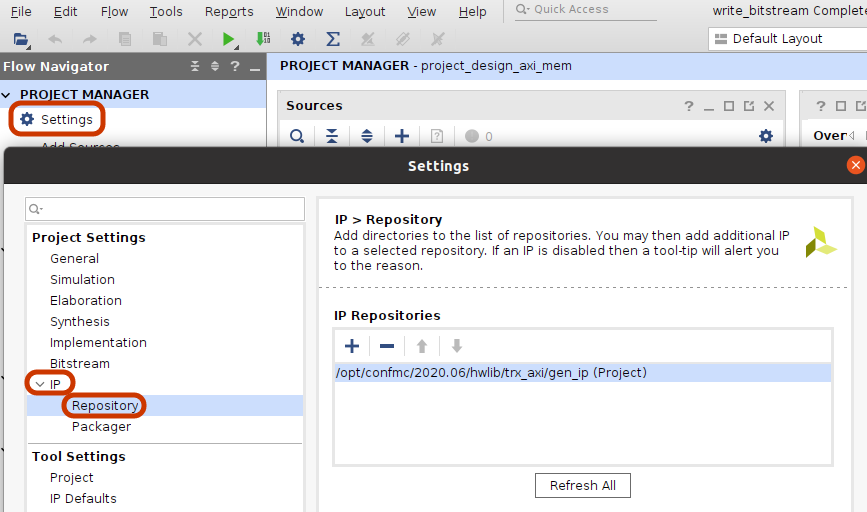
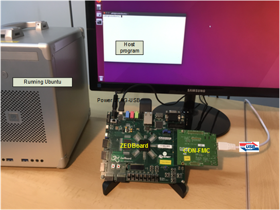

# CON-FMC<sup>TM</sup> with AMBA AXI MEM
This example writes and reads memory in the FPGA through USB along with Future Design Systems' CON-FMC.


## License
**Copyright 2022 Future Design Systems, Inc.**<br>
This is licensed with the 2-clause BSD license to make the program and library useful in open and closed source products independent of their licensing scheme.<br>
Each contributor holds copyright over their respective contributions.

This example is prepared in the hope that it will be useful to understand Future Design Systems’ CON-FMC, but WITHOUT ANY WARRANTY. The design is not guaranteed to work on all systems. No technical support will be provided for problems that might arise


## Prerequisites
This example requires followings.
* Shell: Bash
* GNU GCC: C compiler
* HDL simulator: Mentor Graphics ModelSim
* FPGA development: Xilinx Vivado or ISE depending on your FPGA board
* FPGA board: Xilinx FPGA mounted board with FMC
* Future Design Systems CON-FMC board
* Future Design Systems CON-FMC SW package
* Python

## Maturity
* RTL simulation
* FPGA proven (refer to [CON-FMC](#con_fmc))

# 1. <a name="environment"></a>Check or prepare environment

<details><summary>Click to expand</summary>

### 1.1 CON-FMC software package
This example requires CON-FMC software package.
If CON-FMC SW pkg is installed on */opt/confmc/2020.06*,
then source following script.
If not, install it that is available from <a href="https://github.com/github-fds/confmc.x86_64.linux.2020.06" target="_blank">here</a>
(The directory should reflect actual one.)

    $ source /opt/confmc/2020.06/setting.sh

### 1.2 Xilinx development package
This example requires Xilinx development package; Vivado or ISE depending on FPGA type.

#### 1.2.1 Xilinx Vivado
If Xilinx Vivado pkg is installed on */opt/Xilinx/Vivado/2018.3* or */tools/Xilinx/Vivado/2022.1*,
then source following script.

    $ source /opt/Xilinx/Vivado/2018.3/settings64.sh
    or
    $ source /tools/Xilinx/Vivado/2022.1/settings64.sh

When Avnet ZedBoard is used, License Free Version called *Vivado WebPack* will be fine, which
is now called *Vivado ML Standard Edition*.
It is available from <a href="https://www.xilinx.com/support/download.html" target="_blank">here</a>
and Xilinx account is required to get it.

#### 1.2.2 Xilinx ISE
If Xilinx ISE pkg is installed on */opt/Xilinx/14.7*,
then source following script.

    $ source /opt/Xilinx/14.7/ISE_DS/settings64.sh

### 1.3 LibUsb
The CON-FMC pkg uses LibUSB package and it can be checked as follows.

    $ ldconfig -p | grep libusb
    (standard input):	libusbmuxd.so.4 (libc6,x86-64) => /usr/lib/x86_64-linux-gnu/libusbmuxd.so.4
    (standard input):	libusb-1.0.so.0 (libc6,x86-64) => /lib/x86_64-linux-gnu/libusb-1.0.so.0
    (standard input):	libusb-1.0.so (libc6,x86-64) => /usr/lib/x86_64-linux-gnu/libusb-1.0.so

If it is not installed, install it as follows.

    $ sudo apt-get install libusb-1.0.0-dev

</details>

# 2. Internal design
Following picture shows a rough structure of the design.



Host program generates AMBA AXI bus transactions on the bus in the FPGA, where
the host program can be written in C/C++ or Python.

### 2.1 Directory structure

<details><summary>Click to expand</summary>

```
|-- doc                 Document
|-- HowToRun.txt        Quick start
|-- hw                  HW part
|   `-- impl               Vivado implementaion project
`-- sw.native           SW project using native C/C++
    `-- test_mem           Memory testing program
```
</details>

# 3. FPGA implementation

<details><summary>Click to expand</summary>

### 3.1 Vivado case
Following steps are for ZedBoard.

  1. go to 'hw/impl/vivado.zed.lpc <br />
  2. run Vivado setup script<br />
     ```
     $ source /tools/Xilinx/Vivado/2022.1/settings64.sh
     ```
  3. run CON-FMC setup scrip<br />
     ```
     $ source /opt/Xilinx/14.7/ISE_DS/settings64.sh
     ```
  4. run 'make'<br />
     ```
     $ make
     ```
  5. run following Vivado Tcl procedure, which is defined in 'run_vivado.tcl'<br />
     ```
     syn_impl
     ```
  6. 'design_axi_mem_wrapper.bit' should be ready in the following directory
     ```
     project_design_axi_mem/project_design_axi_mem.runs/impl_1/design_axi_mem_wrapper.bit
     ```

#### 3.1.1 Notes
*BFM_AXI* should be *Version 1.1 (future-ds.com:user:bfm_axi_if:1.1)* and
must be added as a new IP through 'Setting->IP->Repository' menu.



Alternatively, use following Vivado Tcl command, which is already included in 'design_axi_mem.tcl'

```
set_property  ip_repo_paths  /opt/confmc/2020.06/hwlib/trx_axi/gen_ip/vivado.z7 [current_project]
update_ip_catalog -rebuild
```
</details>

# 4. Running with C program

### 4.1 Vivado case
This step runs C program along with FPGA board as shown in the picture below.
This example uses the FMC connector on Avnet ZedBoard.

<!--  -->


<details><summary>Click to expand</summary>

### 4.1.1 Linux

  1. make sure all connections are ready
     * board power turned off
     * connect USB-to-JTAG to the host computer
     * connect CON-FMC to the host computer
     * board power turned on
     * check CON-FMC is detected as follows
       ```
       $ lsusb
       ```
       This command should display something like below, where '04b4:00f3' is important,
       which indicates CON-FMC.
       ```
       ...
       Bus 005 Device 087: ID 04b4:00f3 Cypress Semiconductor Corp.
       ...
       ```

  2. program FPGA<a name="program-vivado"></a>
     This step requires Xilinx Vivado package. Refer to [environment](#environment).

     Invoke *Vivado Hardware Manager* and download bit-stream.
     ```
     hw/impl/vivado.zed.lpc/project_design_axi_mem/project_design_axi_mem.runs/impl_1/design_axi_mem_wrapper.bit
     ```

     Alternatively, use following script.
     1. go to 'hw/impl/vivado.zed.lpc/download'
     2. run 'make'
        ```
        $ make
        ```
        You can use Xilinx Vivado HW manager if you like.
     3. make sure that the configuration down LED lit.

  3. compile C program
     This step requires CON-FMC SW pkg. Refer to [environment](#environment).
     Make sure that CON-FMC setup has been done.<br />
     1. got to 'sw.native/test_mem'<br />
     2. run 'make'
        ```
        $ make
        ```
     3. make sure that 'test' program is ready without any errors.

  4. run the program
     This step requires CON-FMC SW pkg. Refer to [environment](#environment).
     Simply run as follows.
        ```
        $ make run
        ```
     Alternatively, run the program as follows.
     1. run 'test' with '-h' option to see options
        ```
        $ ./test -h
        ```
     2. run 'test'
        ```
        $ ./test -c 0 -m 0:0x8000 -l 3 -v 3
        ```
        * '-c 0' should reflect CON-FMC CID.
        * '-m 0:0x8000' indicates memory testing from 0x0 to 0x8000 upward.
        * '-l 3' level of memory test
        * '-v 3' level of verbosity
     3. now follow on-screen instruction

</details>

# Other things

---
### Author(s)
* **[Ando Ki](mailto:contact@future-ds.com)** - *Initial work* - <a href="http://www.future-ds.com" target="_blank">Future Design Systems</a>

### Acknowledgments

